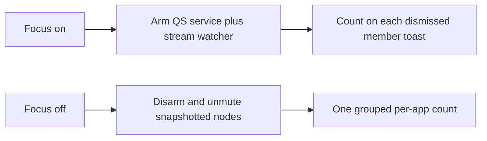

# Focus-mode distraction notification block

> HTML render lens: [.flow/artifacts/fn-2-focus-mode-distraction-notification/spec.html](../artifacts/fn-2-focus-mode-distraction-notification/spec.html) — regenerable, markdown is the record. <!-- flow-next:artifact-link -->

## Conversation Evidence

> user (turn 1): "next spec is that all notifications from distraction space should also be blocked. So during focus mode i don't want to get a notification from apps in distraction space."

## Overview

While focus mode is on, distraction-space apps send no banner and no sound. Other apps keep notifying. Focus off lifts this spec's mute, then one grouped notice lists a count per app that pinged (and may play one sound). Empty sessions skip that notice.

## Goal & Context
<!-- scope: business -->

The person using this plugin already hides the distraction workspace when focus mode is on. Those apps still send desktop banners and sounds, so a chat ping can break focus without the window being visible. Winning is a full focus session with zero banners and zero sounds from those apps. When focus turns off, one grouped notice lists a count per app that pinged, and may play one sound. Copy matches Omarchy's native voice, the same matter-of-fact tone as the bar eye and the 50-character reason field. This spec sits beside the network-destination block and can ship in either order.

## Architecture & Data Models
<!-- scope: technical -->

Focus on applies a per-app mute. Focus off lifts only the mute this spec applied. Membership is the shipped window-rule apps that belong to the distraction workspace, not fn-1's extra network destinations.

**Enforcement (resolved against the live Omarchy 4 stack).** The notification daemon is the Quickshell `NotificationServer` inside omarchy-shell. There is no mako and no dunst. This plugin already lives in that world (`BarWidget.qml` imports `Quickshell`, `qs.Commons`, `qs.Ui`).

Cited live sources (default branch of basecamp/omarchy, resolved as omacom/omarchy @ `b686ed89`, not stale `master`):

- [Omarchy manual](https://learn.omacom.io/2/the-omarchy-manual) and [hotkeys](https://learn.omacom.io/2/the-omarchy-manual/53/hotkeys). Super+, dismisses the latest. Super+Shift+, dismisses all. Super+Ctrl+, toggles silencing. Super+Alt+, invokes the most recent. The published manual still names some Omarchy 3 surfaces (waybar/mako in the theme chapter). The live daemon is Quickshell.
- [docs/notifications.md](https://github.com/basecamp/omarchy/blob/HEAD/docs/notifications.md). The shell claims `org.freedesktop.Notifications`. Decision logic lives in `NotificationLogic.js`.
- [docs/omarchy-shell.md](https://github.com/basecamp/omarchy/blob/HEAD/docs/omarchy-shell.md). Plugin kinds include `bar-widget` and `service`. A plugin id referenced anywhere in `shell.json` is enabled; this plugin's existing `bar.layout` entry therefore enables both kinds. IPC is `omarchy-shell`.
- [default/hypr/bindings/utilities.lua](https://github.com/basecamp/omarchy/blob/HEAD/default/hypr/bindings/utilities.lua). Super+comma maps to `omarchy-shell notifications dismissOne` / `dismissAll` / `invokeLast`. Super+Ctrl+comma is the `notification-silencing` toggle. Super+Shift+Alt+comma is `showHistory`.
- [bin/omarchy-toggle-notification-silencing](https://github.com/basecamp/omarchy/blob/HEAD/bin/omarchy-toggle-notification-silencing). Runs `omarchy-shell notifications toggleDnd` and refreshes `omarchy.indicators`.
- `Service.qml`. DND is one boolean persisted as `dnd` in `~/.local/state/omarchy/notifications.json`. IPC exposes `toggleDnd`, `setDnd`, `dndState`, `dismissOne`, `dismissAll`, `dismiss(summary)`, `invokeLast`, `showHistory`. `dismiss(summary)` is deliberately **not** usable here: it removes every popup whose summary contains the needle, regardless of app, and would violate R2 on a collision. A DND-silenced toast is written to history. Live toasts are mirrored as one JSON file each under `~/.local/state/omarchy/notifications/`.
- `shell/shell.qml`. Every plugin service receives the live `shell` object. `shell.serviceFor("omarchy.notifications")` returns the built-in notification service instance, whose `popupModel`, `liveRefs`, serialized popup-file queue, and exact model row are available in the same QML engine. `omarchy.notifications` is the manifest plugin id; `notifications` is only its IPC target and is not a valid `serviceFor` key. This is the per-toast integration point; no second `NotificationServer` is created.
- `NotificationLogic.js`. `shouldBypassDnd` lets through `app_name=omarchy-action` and critical `notify-send` only. Chat brands do not bypass. Snapshot identity is `app` (`appName`) plus `appIcon`.
- [docs/audio-tuning.md](https://github.com/basecamp/omarchy/blob/HEAD/docs/audio-tuning.md). Speaker DSP only. Restarting PipeWire drops Pulse clients. Not a per-app mute API.
- The published [Omarchy CLI](https://learn.omacom.io/2/the-omarchy-manual/115/omarchy-cli) page lists `omarchy` groups. It has no per-app notification mute. Plugin enable is `omarchy plugin enable` / `omarchy bar` as documented in `docs/omarchy-shell.md`.

**Whole-desktop mute still fails R2.** `toggleDnd` hides every non-bypass toast. This spec never calls `omarchy-toggle-notification-silencing`, `toggleDnd`, or `setDnd`.

**Chosen banner mechanism.** A plugin-owned Quickshell `service` entry (same imports and host injection as `BarWidget.qml`) that is armed while the focus flag is on.

1. Resolve `shell.serviceFor("omarchy.notifications")` lazily with a bounded retry timer, and expose plugin IPC `ping` as ready only after binding and API checks succeed. Observe its `popupModel` with an invisible `Instantiator`; `onObjectAdded(index, object)` captures immutable `originalId` + `timestamp` but never mutates the model synchronously. Before resolving `liveRefs`, call the built-in `isRestoredRow(row)`, since original ids can collide across server generations. Native Telegram/Signal rows match `app` / `appIcon`. Chromium-derived rows first require a generic browser-family app identity, then parse **only the leading origin token** in body text with the same anchored forms as `NotificationLogic.js` (`^\s*` anchor/link or bare URL), normalize its host, and exact-match one shipped PWA host. A member host mentioned later in prose is ignored. Generic `app`, `appIcon`, and desktop-entry never count as member identity. A missing/malformed leading origin leaves the row visible. Never create another `NotificationServer`. Never match `omarchy-action` or `notify-send`.
2. Suppress the **exact matched row**, not a summary string. Schedule `Qt.callLater`, relocate the row by `originalId` + `timestamp` (indices may have shifted), re-run identity and `isRestoredRow` checks, and verify the same captured live ref still occupies `liveRefs[originalId]`. Then queue `deletePopupFileFor(row)` on the built-in service's serialized file queue, remove that one relocated model index, and dismiss the captured ref. Persistence is queued before model insertion and deletion is queued after it, so the serialized delete wins. This path intentionally bypasses `dismissPopup` / `removePopup`, whose archive step would expose the ping in history. If any required same-engine member (`serviceFor`, `popupModel`, `liveRefs`, `isRestoredRow`, `deletePopupFileFor`) is absent, disarm and fail apply under R8.
3. Increment the count file only after that exact-row suppression has been queued successfully. No history file is created, so Omarchy history is not a mid-focus reader (R7). Do not use `dismiss(summary)`, `dismissOne`, `dismissAll`, DND, or the DND `writeSilenced` path.
4. Leave every non-member toast on screen.

`enable_focus` and `listen` (when the focus flag is on) apply. `disable_focus` lifts. Apply is idempotent. The service reads the focus flag from the existing XDG file, so a shell restart does not require a second source of truth.

On every `Component.onCompleted` (shell restart or any plugin reload), the service re-reads the focus flag, retries built-in service resolution until ready/timeout, and re-arms itself. The same `Instantiator` handles restored rows without needing a nonexistent restore-complete signal: for a member row where `isRestoredRow(row)` is true, asynchronously test whether its exact `NotificationLogic.popupFileName(row)` exists in the active popup directory, retrying a miss for a short bounded window so the built-in restore write can drain. An active-file hit is a restart-restored popup; defer, relocate by filename, remove that model row, delete `restoredPopups[filename]`, and delete that active file. After the bounded misses, a history-only `showHistory` replay stays visible. This closes the case where a shell reload destroys an in-flight serialized delete without scanning or deleting history.

Plugin install/update performs the one-time `omarchy-shell shell rescanPlugins` after the manifest gains its service entry. It is never part of steady-state apply: live `rescanPlugins` unloads every shell service, including the notification server. The plugin id already appears in `bar.layout`, and `PluginRegistry.isEnabled()` treats a reference anywhere in `shell.json` as enabling every declared kind; no redundant `plugins[]` mutation is needed. Steady-state apply waits for the plugin service's own IPC `ping`; a bounded timeout or missing ping fails closed under R8 and tells the user to reload/install correctly without restarting the shell itself. Lift only disarms the filter.

**Chosen sound mechanism.** The notification server does not play sounds. Apps emit them. PipeWire node properties cannot tell Chromium PWAs apart (review blocker). This spec does not mute by `application.name` of Chrome or Chromium.

The session-long `distractions listen` process is the sole owner of a **stream watcher** (not a one-shot mute of current inputs). A dedicated worker thread owns a long-lived `pactl subscribe` subprocess while the main thread keeps reading the Hyprland socket. On each sink-input `new`/`change` event it reads `pactl --format=json list sink-inputs`, evaluates unseen inputs, and mutes an exact input with `pactl set-sink-input-mute <index> 1`. It reads the focus file on startup and on change, evaluates new inputs only while armed, and disarms/unmutes on focus-off. Short-lived `focus`, `focus-on`, and `focus-off` processes never spawn or own a watcher. They update the focus flag, then wait on a runtime watcher-status file (pid, generation, armed state, last error) for the listener to acknowledge the same generation. A missing `pactl`, unhealthy subscription/list command, dead listener, or bounded acknowledgement timeout is an apply/lift failure under R8/R3, not a detached fallback.

- Native members (Telegram, Signal). Mute nodes whose `application.name` or `application.process.binary` maps to that member.
- Chromium PWA members. On each new node, inspect `/proc/<pid>/cmdline`, then walk its `/proc` parent chain to the first Chromium app ancestor. Mute only when a leaf or ancestor cmdline contains the shipped host or app-id (`discord.com`, `web.whatsapp.com`, `x.com`, `messages.google.com`). Stop at a bounded depth and guard PID reuse by re-reading the pid/start-time tuple. If proc data is hidden or no ancestor carries that identity, leave the node unmuted. That is an accepted miss. Muting every Chromium event stream is not allowed (R2).
- New streams. The watcher evaluates every new node while armed. Snapshot each node id this spec mutes.
- Persistent configuration. The focus flag plus monotonic generation is the arming request. Autostart already runs the sole `listen` owner. Apply/lift wait for its matching armed/disarmed acknowledgement and never spawn a second watcher. Lift unmutes only snapshotted node ids. A WirePlumber user drop-in is allowed only when it can load without restarting PipeWire or WirePlumber (those restarts drop clients). If a drop-in needs a restart, do not ship it. The watcher is the contract.
- Default sink stays untouched.



**Identity map.** `notification-members.json` is the canonical shipped membership table read by both QML banner filtering and the Python stream watcher. Each row carries its display label, native notification `app` / `appIcon` identities, native PW keys, and Chromium host/app-id identities. Chromium banner payloads use the exact URL host extracted from body text; Chromium sounds use the same host/app-id in process ancestry. A bare `Google Chrome` / `Chromium` / `Brave` app, icon, or desktop-entry is never member identity. Tests compare table members with shipped `hypr/windows.lua` rules so workspace, banner, and sound sets cannot drift silently. Super+Alt+D of an unnamed class is not added to the mute set.

If a shipped member cannot be matched without also matching non-members, apply fails for the whole mute (R8). Focus still turns on. Early proof stops before count work.

**Count store.** A JSON object in XDG state, sibling of the focus flag. Keys are display labels. Values are integers. The QML service serializes increments through one subprocess queue; each helper takes a dedicated count-file `flock`, reads/merges, writes a sibling temp file, fsyncs, and atomically renames. On lift, service IPC disarms first and reports `drained` only after its pending suppression/count queue is empty. Python waits for `drained`, then takes the same count lock for read plus successful-notice clear; if notice fails it leaves the file intact. Thus a boundary ping is either counted before catch-up or arrives after disarm and remains visible, never lost to clear. Nothing reads it into a UI while focus is on. Individual banners are never replayed.

**Hooks.** `enable_focus` applies. `disable_focus` lifts, then sends the grouped notice if any count is above zero. `listen` reapplies when the focus flag is on (login, crash, Hyprland events). Apply is idempotent.

**fn-1 overlap.** Both specs call from the same focus on/off hooks. This spec adds named apply/lift functions and does not take over the network block. No spec-level dependency. Either order can land.

## API Contracts
<!-- scope: technical -->

- `apply_notification_block() -> ok | fail`. Fail tells the user through the existing notify helper, rolls back any partial mutation (service arm, watcher arm, node mutes), and leaves the previous notification and audio state unchanged. Focus still turns on (R8).
- `lift_notification_block() -> ok | fail`. Fail tells the user. Mutes this spec applied may remain until a later successful lift (R3). Focus can still turn off.
- Count file shape. `{ "<app-label>": <int>, ... }`. Missing file means zero pings. Increment and read/clear share the count lock and atomic-rename discipline. Successful grouped notice clears the file while holding that lock.
- Grouped notice. One `notify()` call. Body lists each app that pinged and its count. May play one sound. The existing helper is the sender. This spec does not add a new sound player. Zero apps means no grouped notice. The existing "Focus mode off" toast stays as the mode-change toast.
- Plugin toasts (`omarchy-notification-send` / `notify-send`, including the default `omarchy-action` app name) stay visible under the filter.

## Edge Cases & Constraints
<!-- scope: technical -->

- User Super+Ctrl+, DND stays independent. This spec never toggles that boolean. When the user has DND on, non-member toasts stay silenced by Omarchy. Member toasts stay in our count path if the service still sees them; if DND swallows them into history before we match, treat that as Omarchy DND (not our catch-up) and do not invent a second history reader.
- Shell/plugin restart. The service reloads, re-reads the focus flag in `Component.onCompleted`, and reconciles active member popup files left by an interrupted queue. The external session listener and its stream watcher stay up; focus generation remains the arming bit.
- Missing omarchy-shell, missing `NotificationServer` bus name, or a daemon that is still mako is an apply fail (R8). This spec has one mechanism (Quickshell). It does not keep a mako fallback.
- Dual-kind load. Install/update performs one rescan and verifies ping. Steady-state apply never rescans; if plugin `ping` times out or `shell.serviceFor("omarchy.notifications")` lacks the exact-row members named above, apply fails and rolls back.
- Partial apply rolls back all of this spec's mutation. A listener acknowledgement timeout records its last error and does not spawn a fallback watcher.
- Rapid double-toggle. Apply and lift use a dedicated short-lived advisory lock, distinct from the session-long `LISTEN_LOCK`, so two `focus` invocations cannot leave an armed watcher or a split count file.
- `focus-on` / `focus-off` share the same apply and lift as the zenity path.
- First install. `ensure_focus_default` plus `listen` apply the mute when the default is on.
- After lift-fail, the focus flag may read off while the filter or node mutes remain. The next successful lift (focus on then off, or a later lift call) is the retry. No extra UI.
- If the grouped notice send fails after a successful lift, keep the counts for a later successful notice. Do not replay individual banners.
- Lift waits for the filter's disarmed-and-drained acknowledgement before reading counts. Timeout is a lift failure under R3 and leaves counts untouched.
- Suppress-after-insert may flash one frame. A flash that clears is an accepted miss. A toast that stays visible, a non-member row that disappears, or a blocked row/history file that survives the serialized delete is an apply/proof fail. `showHistory` replay rows have no live ref and are left untouched even when their app identity is a member.
- Chromium PWA body-origin and cmdline strings are verified on a live Omarchy 4 box against every shipped window-rule app. The match rule (exact URL host/body origin for banners; host/app-id ancestry for sounds; never generic browser identity) is the contract.
- A PWA notification sound whose chrome pid cmdline lacks the shipped host or app-id stays unmuted. That miss is recorded. Do not widen the mute to all Chromium audio.
- A Chromium PWA banner whose body has no parseable shipped URL host stays visible. That miss is recorded. Do not widen the filter to generic Chromium/Chrome/Brave app identity.

## Scope

In scope. Per-app banner hide and per-app sound mute for shipped workspace apps. Restore. One grouped count. README and manifest copy.

Out of scope. See Boundaries.

## Approach

1. Add a Quickshell `service` entry next to `BarWidget.qml`. Arm it from `apply_notification_block`. Resolve the built-in service through `shell.serviceFor("omarchy.notifications")`, require a live ref, and suppress only the matched model row/ref; never use summary IPC. Queue popup-file deletion on the built-in serialized queue so no history entry is created. Count only after suppression is queued.
2. Add `notification-members.json` as the one shipped membership table for both QML and Python. Map native apps to notification/Pulse keys and Chromium PWAs to exact URL hosts/app-ids shared by body-origin banner matching and process-ancestry sound matching. Unit-test URL-host extraction, generic-browser negatives, fixtures, and parity with `hypr/windows.lua`. Live strings are an investigation check, not a settings surface.
3. Hook apply/lift into the existing focus on/off/listen paths. Fail-closed apply. Snapshot-and-rollback. Do not call `omarchy-toggle-notification-silencing` or `setDnd`.
4. Add the PipeWire subscription as one worker owned by the existing session-long `listen` process. Short-lived toggles write a focus generation and wait for its status acknowledgement. For Chromium, walk the bounded parent chain and require a host/app-id on a leaf or ancestor. Snapshot muted node ids. Lift acknowledgement comes only after those ids are unmuted.
5. On successful lift, send one grouped `notify()` if any count is above zero. May play one sound through the existing helper. No new player.
6. Document the mute and the catch-up in README and the plugin manifest, including the dual `service` kind loaded through the existing bar-layout enablement.

## Quick commands

```bash
python3 -m py_compile distractions
if command -v qmllint >/dev/null; then qmllint NotificationFilter.qml; fi
python3 -m unittest discover -s tests -p 'test_*.py'
```

## Acceptance Criteria
<!-- scope: both -->

- **R1:** While focus mode is on, the user does not receive a notification from any app that belongs to the distraction space. Errors: if apply fails, the plugin tells the user and leaves the previous notification state unchanged. [paraphrase]
- **R2:** Notifications from apps that do not belong to the distraction space still appear while focus mode is on. Errors: no error surface beyond R1. [paraphrase]
- **R3:** Turning focus mode off restores notifications from the distraction-space apps. Errors: if the lift fails, the plugin tells the user and blocks may remain until a later successful lift.
- **R4:** After focus turns off, one grouped notice lists a count per distraction-space app that pinged. Errors: if nothing was blocked, show no notice. [user]
- **R5:** That grouped notice may play one sound. Errors: no error surface beyond R4. [user]
- **R6:** While focus is on, both the popup banner and the sound from those apps are blocked. Errors: no error surface beyond R1. A PWA sound whose process cmdline lacks the shipped host or app-id is the recorded miss under Decision Context, not a widening of the mute. [user]
- **R7:** There is no way to read blocked pings or a running summary while focus is on. Errors: no error surface beyond R1. [user]
- **R8:** If the mute cannot apply, the plugin tells the user, leaves pings as they were, and focus can still turn on. Errors: no error surface beyond R1. [user]

## Boundaries
<!-- scope: business -->

- Network destination blocking stays the sibling spec. This spec is notifications only. [paraphrase]
- Extra destinations that are not apps in the distraction space are not a notification-block set here. [paraphrase]
- A whole-desktop mute that blocks every app is out of scope.
- Unread badges are out of scope. The user has no badge surface. [user]
- No history screen and no per-app notification toggles. Workspace membership is the list. [user]
- No allow-list and no urgent bypass. If the app lives in the space, it is silent until focus is off. [user]
- Agent-parsed "important things" summary is a later sibling spec. This spec ships a grouped count without an agent. [user]
- Super+Alt+D of an unnamed class is not added to the mute set.
- Individual blocked banners are discarded, not replayed.
- SwayNC is not the daemon and is not in scope.
- `omarchy-toggle-notification-silencing` / Quickshell `doNotDisturb` is the user's own whole-desktop mute and is not this spec's apply path.
- A mako custom mode is not the mechanism. The live daemon is Quickshell.
- Muting every Chromium or Chrome audio node is out of scope.

## Decision Context
<!-- scope: both -->

### Motivation
<!-- scope: business -->

Winning is a focus session with no banner and no sound from distraction-space apps. A grouped per-app count after focus-off is enough. Opening the apps after is how you catch up. A thin count is an accepted miss. The mute and the catch-up ship together. This work can ship before, after, or with the network block.

### Implementation Tradeoffs
<!-- scope: technical -->

Hiding the distraction workspace does not stop notification banners or sounds. The user asked for those notifications to be blocked while focus mode is on, scoped to apps in that space.

This is a sibling of the network-destination block. Same focus-mode gate. Different surface.

**D1 · daemon.** Chosen. Plugin Quickshell `service` plus a session stream watcher. The injected `shell` resolves manifest id `omarchy.notifications` (distinct from IPC target `notifications`); the plugin removes only the matched row/live ref and queues deletion behind persistence. Cited. `docs/notifications.md`, `docs/omarchy-shell.md`, `shell/shell.qml`, `Service.qml`, `utilities.lua`, `omarchy-toggle-notification-silencing`, `NotificationLogic.js`, `docs/audio-tuning.md`, Omarchy manual hotkeys, this plugin's `BarWidget.qml`. Rejected. `dismiss(summary)` (unscoped all-app substring purge, R2). Rejected. Whole-desktop `toggleDnd` (R2). Rejected. Mako custom mode (live daemon is Quickshell; host plan-review MAJOR_RETHINK). Rejected. SwayNC (Omarchy does not ship it). Rejected. Cloning `omarchy.notifications` (reserved `omarchy.*` ids, upgrade-fragile).

**D2 · membership.** Chosen. Shipped window-rule apps. Native apps map to notification `app` / `appIcon` and Pulse keys. Chromium PWAs map to exact URL hosts: extracted from banner body origins and found in audio process ancestry. Rejected. Generic browser `app` / `appIcon` / desktop-entry and every-Chromium notification/audio matching. Rejected. A settings list or runtime scanner for Super+Alt+D strays (declined extra UI).

**D3 · catch-up.** Chosen. Sidecar count file updated under a shared lock/atomic rename after exact suppression, plus one grouped `notify()` after disarm-and-drain. Rejected. Replaying each banner. Rejected. A mid-focus history screen (declined extra UI). Rejected. Leaving dismissed member toasts in Omarchy history while focus is on (that would be a mid-focus reader).

**D4 · exceptions.** Declined. `.flow/memory/declined/notification-exceptions.md`. No allow-list and no urgent bypass.

**D5 · PWA sound bound.** Chosen. Walk the PipeWire-reported process's bounded parent chain and match a shipped host/app-id on the leaf or an ancestor. Accepted miss. When proc data is unavailable or the full checked chain lacks the identity, that sound stays up. Widening the mute to all Chromium audio fails R2.

**D6 · toast flash.** Accepted miss. Dismiss-after-show may flash one frame. A toast that remains is a fail.

**D7 · PWA banner bound.** Chosen. For Chromium-derived notifications, parse only the anchored leading origin token used by `NotificationLogic.js`, normalize its URL host, and exact-match the shipped host. A host appearing later in message prose is not identity. Generic browser app/icon/desktop-entry is never enough. Accepted miss. A payload with no parseable leading shipped host remains visible; widening to all browser notifications fails R2.

## Early proof point

Task fn-2-focus-mode-distraction-notification.1 performs one explicit live proof on an Omarchy box: the service resolves the built-in service; identical-summary member and non-member toasts leave only the member hidden; a blocked member leaves no popup/history file; a member `showHistory` replay remains visible; every shipped Chromium PWA banner exposes and matches its body origin while a plain-browser notification stays visible; and every shipped Chromium PWA sound records whether leaf/ancestor identity matched. Missing or inconsistent identity in the normal tested PWA path is a failed proof, not an accepted generic-browser widening. If apply cannot stay per-app, requires `dismiss(summary)`/DND, or PWA identity only works as "all Chromium", stop and re-evaluate before count/catch-up work.

## Requirement coverage

| Req | Description | Task(s) | Gap justification |
|-----|-------------|---------|-------------------|
| R1 | No banners from workspace apps while focus is on | fn-2-focus-mode-distraction-notification.1 | — |
| R2 | Other apps still notify | fn-2-focus-mode-distraction-notification.1 | — |
| R3 | Focus off restores this spec's mute | fn-2-focus-mode-distraction-notification.1, fn-2-focus-mode-distraction-notification.2 | — |
| R4 | One grouped per-app count after focus off | fn-2-focus-mode-distraction-notification.2 | — |
| R5 | That notice may play one sound | fn-2-focus-mode-distraction-notification.2 | — |
| R6 | Banner and sound both blocked | fn-2-focus-mode-distraction-notification.1 | PWA cmdline-miss is D5, not a second mute |
| R7 | No mid-focus reader | fn-2-focus-mode-distraction-notification.2 | — |
| R8 | Apply-fail tells the user, leaves prior state, focus still on | fn-2-focus-mode-distraction-notification.1 | — |

## Resolved via Project Docs

- `README.md`: Focus mode is on by default. Super+D is the only way into the distraction space, and only after focus is off. Turning focus off requires a zenity reason of at least 50 characters. The bar control is an eye icon.
- `.flow/specs/fn-1-focus-mode-network-distraction-block.md`: Sibling spec blocks network destinations while focus is on. This spec is notifications only.
- `CHANGELOG.md`, `STRATEGY.md`, `GLOSSARY.md`, `knowledge/decisions/`: absent.

## Resolved via Omarchy docs and config

- [Omarchy manual](https://learn.omacom.io/2/the-omarchy-manual)
- [Hotkeys / notifications](https://learn.omacom.io/2/the-omarchy-manual/53/hotkeys)
- [Omarchy CLI](https://learn.omacom.io/2/the-omarchy-manual/115/omarchy-cli)
- [docs/notifications.md](https://github.com/basecamp/omarchy/blob/HEAD/docs/notifications.md) (default branch, Quickshell `NotificationServer`)
- [docs/omarchy-shell.md](https://github.com/basecamp/omarchy/blob/HEAD/docs/omarchy-shell.md) (plugin kinds, `plugins[]`, IPC)
- [docs/audio-tuning.md](https://github.com/basecamp/omarchy/blob/HEAD/docs/audio-tuning.md) (speaker DSP; PipeWire restart drops clients)
- [bin/omarchy-toggle-notification-silencing](https://github.com/basecamp/omarchy/blob/HEAD/bin/omarchy-toggle-notification-silencing)
- [default/hypr/bindings/utilities.lua](https://github.com/basecamp/omarchy/blob/HEAD/default/hypr/bindings/utilities.lua)
- `shell/shell.qml`, `shell/plugins/notifications/Service.qml`, and `NotificationLogic.js` on the default branch
- [Notifications are disabled but still makes a sound](https://github.com/basecamp/omarchy/issues/5073) (app-emitted sounds; the server still does not play them)

## References

- `distractions` focus gate and `notify()` helper
- `BarWidget.qml` Quickshell bar widget
- `hypr/windows.lua` shipped workspace apps
- `.flow/memory/declined/notification-extra-ui.md`
- `.flow/memory/declined/notification-exceptions.md`
