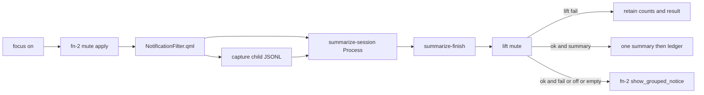

# Focus-mode agent notification summary

> HTML render lens: [.flow/artifacts/fn-3-focus-mode-agent-notification-summary/spec.html](../artifacts/fn-3-focus-mode-agent-notification-summary/spec.html) — regenerable, markdown is the record. <!-- flow-next:artifact-link -->

## Conversation Evidence

> user (turn 1): "summary is good. Note that we should spec out a feature where if user has an agent defined the user can configure the distraction-space to have the agent parse them during focus mode (inaccessible summary in the background) and one summary of important things will be presented at the end"
> user (turn 2): "yes capture that as fn-3"
> user (turn 3): "omarchy lets you define an agent and we should use the one the user has defined. The plugin should keep a ledger on what important means to the user. So the user could say summary not helpful or helpful and leave feedback. That'll be stored to inform the next summary parse."
> user (turn 4): "user will have to choose one but i think i can only enable one?"
> user (turn 5): "there's a default agent set"
> user (turn 6): "i guess you could override it to a cli app"
> user (turn 7): "any of the ones that omarchy allows as an agent"
> user (turn 8): "we should have basically the same selector modal that omarchy has for our summary agent"
> user (turn 9): "well any of them that allow headless invocation like claude -p or similar"
> user (turn 10): "the user needs to enable agent summaries in the plugin. Having an agent in omarchy doesn't immediately consent to agent summaries."

## Goal & Context
<!-- scope: business -->
<!-- Source-tag breakdown: 80% [user] / 20% [paraphrase] -->

The mute spec already hides banners and sounds, then shows a grouped per-app count when focus turns off. That count is a thin catch-up. This spec adds an optional path the user must turn on in the plugin. Having an Omarchy default agent is not consent. Once enabled, the plugin captures blocked-ping text itself, uses the default agent to read that text during focus, and shows one summary of important things when focus turns off. The user can override that default with the same kind of selector modal Omarchy already uses, limited to agents that can run a verified one-shot headless prompt. After each summary, the user can mark it helpful or not and leave feedback. That ledger shapes the next parse. Focus mode still works with agent summaries off. The grouped count stays the catch-up whenever this path is off or fails.

## Overview

This path stays off until `agent_summaries` is true in plugin config. The plugin then captures member-toast text into its own JSONL, resolves one usable Omarchy agent id, runs that agent's documented print one-shot with the captured text plus the ledger, and holds stdout until focus turns off. The user sees one summary, then a helpful / not-helpful note. Mute still owns banners, sounds, and the grouped-count fallback. This spec does not read a raw ping queue from the mute spec. That queue does not exist.

## Architecture & Data Models
<!-- scope: technical -->
<!-- Source-tag breakdown: 70% [paraphrase] / 30% [inferred] -->

The mute spec owns apply/lift, banner dismiss, sound mute, the `{app-label: int}` count file, and `show_grouped_notice()`. This spec owns ping-text capture, the session parser, the summary notice, and the ledger. It never applies or lifts mute.

**One Quickshell service.** Omarchy manifests give each plugin one `entryPoints.service` path ([shell plugins](https://omarchy.org/manual/shell-plugins/), [omarchy-shell](https://github.com/basecamp/omarchy/blob/quattro/docs/omarchy-shell.md)). Planned mute already assigns that slot to `NotificationFilter.qml`. This spec does not add a second service entry. It extends that same service. A child component owned by this spec runs in the incoming-toast handler. Dual-kind load stays mute's job. `kinds` includes `service`. `plugins[]` lists this plugin. The bar widget stays the eye toggle and does not start the parser.

**Ping-text capture (this spec owns it).** Planned mute stores only `{ "<app-label>": <int> }` and discards individual banners. In the same toast handler, before mute dismisses the toast or deletes history, the child sends `{app,title,body,at}` on stdin to a silent `distractions capture-ping` helper while focus is on and `agent_summaries` is true. That helper takes the short-held `summary-state.lock` with a 250 ms bounded blocking timeout, rejects stale/nonfocused sessions, atomically allocates the next session-monotonic `seq` from the control file, appends the complete `{seq,app,title,body,at}` record, and trims oldest records under the same lock to keep JSONL at 64 KiB. Timeout is an append failure and preserves the grouped-count path; it never waits unboundedly or silently falls through as an identity-map miss. Trimming never renumbers survivors. QML never reads or rewrites the JSONL directly; only `capture-ping` mutates it. Membership is mute's identity map only. If that map is not in tree yet, capture writes nothing and the session is empty ping-text (R4). Do not invent a second membership list. The writer does not dismiss the toast and does not increment the mute count.

**Parser location and start.** The parser is the Python subcommand `summarize-session` on the existing helper. It holds runtime `summarize-session.lock` with `LOCK_EX | LOCK_NB` for its full lifetime solely as a singleton guard, separate from both `listen()` and the short-held state lock. Focus-on takes `summary-state.lock`, writes a new session id and control state (unless a lift-fail catch-up is pending), releases it, and reaps any leftover agent child before flipping the focus flag. It applies mute, then takes the short lock again and atomically sets the session-ready marker only after mute succeeds. A 250 ms QML timer polls the ready marker/session id and starts the Quickshell `Process` for a current ready session with summaries enabled; target detection latency is at most 500 ms, and the service never starts from the focus flag alone. If the process exits unexpectedly while focus is still on, the service immediately starts `summarize-session --restart`. That Python path first takes the lifetime singleton guard, then briefly takes `summary-state.lock`, atomically increments durable `parser_restarts`, refuses values above two, and sleeps for 1 s on restart one or 4 s on restart two before initializing. Thus Python, not QML, owns the testable backoff policy. On service startup, an uncleared parser-active marker for a current ready session selects the same `--restart` path. The service only reads restart state and never increments it, so a Quickshell restart cannot reset or double-count the cap. A clean `summarize-finish`, mid-session disable, or finish-request marker clears active/ready state and never restarts. `listen()` restart does not own or kill the session. If the service is not loaded, capture and parse do not run and R4 applies.

The session watches the JSONL file (inotify, or a 250 ms poll if inotify is missing). Each record has the session-monotonic `seq` allocated by `capture-ping`. A mode-`0600`, session-keyed control file atomically stores `next_seq`, `invocations`, `last_consumed_seq`, `parser_restarts`, parser-active/session-ready state, and the finish-request marker. A fresh session seeds `next_seq = 1`; a retained lift-fail session and every parser/Quickshell restart reload it. Before every agent spawn, take short-held `summary-state.lock`, reserve one invocation, advance `last_consumed_seq` through the prompt records, and release; a crash therefore consumes budget and cannot replay paid input. The lifetime singleton guard is never used for state mutation. Restarts reload this state. The first unseen record starts the first one-shot. Later unseen records follow the replacement rules. `capture-ping` is the only record handoff; there is no separate parser-kick subcommand.

**Mute seam (thin contract, not a queue).** After a valid leave-focus reason, finish the session, then lift mute, then choose exactly one catch-up surface.

1. Summaries off, no usable agent, empty ping-text buffer, or any invoke/display failure. Call `show_grouped_notice()` so the mute catch-up still runs (R4, R6).
2. Success with a non-empty summary. Show one summary notice. Clear the count file silently. Do not call `show_grouped_notice()`.

XOR runs only after `lift_notification_block()` returns ok. On lift failure, tell the user. Keep the count file, ping-text, result, and session id. Show neither summary nor grouped notice. Do not clear counts (R16). Focus may still turn off. The next successful lift retries this XOR, including after a later focus-on / focus-off cycle. `enable_focus()` after a pending lift-fail does not discard that retained catch-up.

`show_grouped_notice()` is a named function. If mute inlined the notice inside `disable_focus()`, this spec extracts that call so the notice cannot fire before the summary decision. When `agent_summaries` is false, `disable_focus()` keeps mute's lift-then-grouped-notice order unchanged. Empty ping-text with a nonzero count file uses the grouped notice. Capture miss must not hide mute's catch-up.

The existing "Focus mode off" toast stays.

**Consent and identity.** Plugin config gains `agent_summaries` (boolean, default false) and `summary_agent` (`claude`, `grok`, or null). Null means "use Omarchy's default." Resolve the default with `omarchy default agent` (no args). That command prints the id in `~/.config/omarchy/defaults/agent` and prints nothing when unset ([Omarchy AI manual](https://omarchy.org/manual/ai/), [`bin/omarchy-default-agent`](https://github.com/basecamp/omarchy/blob/quattro/bin/omarchy-default-agent)). Only resolved ids `claude` and `grok` are usable. A plugin override does not write that Omarchy file. A rejected config write uses a temp-file rename and leaves the previous object unchanged.

**Picker.** Enable and override use `omarchy-menu-select`. That binary summons `omarchy.menu` in `mode: "select"` and blocks on a tempfile handshake ([`docs/menu.md`](https://github.com/basecamp/omarchy/blob/quattro/docs/menu.md), [`bin/omarchy-menu-select`](https://github.com/basecamp/omarchy/blob/quattro/bin/omarchy-menu-select)). It is the same visual plugin Omarchy uses as dmenu, which satisfies "same kind" (R12). It is not the Setup > Defaults > Agent submenu. That submenu is routed checked rows with actions. Select mode has no checkmarks. Agent row labels reuse `setup.default.agent.*` from [`default/omarchy/omarchy-menu.jsonc`](https://github.com/basecamp/omarchy/blob/quattro/default/omarchy/omarchy-menu.jsonc). The closed offered set is exactly `claude` and `grok`, plus an "Omarchy default" row on the override picker. No other Omarchy agent id is offered or accepted as an override.

**Headless invoke.** The plugin does not call `omarchy agent` or `omarchy agent prompt`. Those launch an unattended interactive TUI with each agent's don't-stop-to-ask flags ([`bin/omarchy-agent`](https://github.com/basecamp/omarchy/blob/quattro/bin/omarchy-agent), [`bin/omarchy-agent-prompt`](https://github.com/basecamp/omarchy/blob/quattro/bin/omarchy-agent-prompt), [legacy Omarchy CLI page](https://learn.omacom.io/2/the-omarchy-manual/115/omarchy-cli)). The current Quattro manual is [omarchy.org/manual](https://omarchy.org/manual/) and [omarchy.org/manual/ai](https://omarchy.org/manual/ai/). The plugin spawns the selected agent's own one-shot from the closed table, passes ping text plus ledger as the prompt, and captures stdout. Shared spawn rules for both rows. Dedicated empty cwd (not `$HOME`, not the plugin tree). Process group. Sanitized environment. No session persistence or resume. No auto-approve / yolo / bypass-permissions flags.

Closed table (exact argv). Claude reads the prompt on stdin. Grok's `-p` / `--single` consumes the next argv token, so the bounded prompt is that final token and no flag follows it.

| id | Argv | Prompt | Bound | Source |
|----|------|--------|-------|--------|
| claude | `claude -p --output-format text --tools "" --disallowedTools "mcp__*" --max-turns 1 --max-budget-usd 0.25 --restricted --no-session-persistence` | stdin | 1 turn, $0.25 | [Claude Code CLI](https://code.claude.com/docs/en/cli-reference). Require Claude Code >= 2.1.248 (`--restricted`; budget enforcement >= 2.1.217). `--tools ""` disables built-ins; MCP is denied; no transcript is persisted. |
| grok | `grok --no-auto-update --output-format plain --tools "" --sandbox read-only --max-turns 1 --no-plan --no-subagents --no-memory --disable-web-search --cwd <empty-cwd> -m grok-4.6 -p <prompt>` | final argv token | 1 turn, 512 completion tokens, zero inference retries | [Grok headless](https://docs.x.ai/build/cli/headless-scripting), [CLI flags](https://docs.x.ai/build/cli/reference), [settings reference](https://docs.x.ai/build/settings/reference) |

For Grok, each invocation creates a private mode-`0700` temporary `GROK_HOME`; copy only the user's Grok `auth.json` into it at mode `0600` when present, or pass through `XAI_API_KEY`. Write a controlled `config.toml` with `[models] default = "grok-4.6"`, `allowed_models = ["grok-4.6"]`, `max_completion_tokens = 512`, and `max_retries = 0`; `[cli] auto_update = false`; `[features] write_file = false` and `tool_search = false`; `[subagents] enabled = false`; `[memory] enabled = false`; and `[permission] deny = ["Bash(*)", "Read(*)", "Edit(*)", "Write(*)", "Glob(*)", "Grep(*)", "MCPTool(*)"]`. Set every `GROK_CURSOR_*_ENABLED` and `GROK_CLAUDE_*_ENABLED` compatibility scanner to `0`, plus `GROK_MEMORY=0`, `GROK_SUBAGENTS=0`, `GROK_WRITE_FILE=0`, `GROK_TOOL_SEARCH=0`, `GROK_LSP_TOOLS=0`, and `GROK_WEB_FETCH=0`. The exact `--tools ""` row removes built-in tools; read-only sandboxing and deny rules are defense in depth if an installed CLI interprets the empty tool selector differently. The private home contains no MCP, plugin, skill, hook, rule, or session config beyond the explicit deny rules, and is deleted after exit. If installed Grok rejects any required flag/config key, cannot authenticate in the private home, does not refuse a proof prompt requesting file/shell access, or does not honor the 512-token cap, treat Grok as unavailable for that invocation and use R4/R6; do not weaken the vector.

Every id other than `claude` and `grok` is outside this feature's closed set. An Omarchy default with any other id resolves empty (R7 then R4).

If the user enables summaries while the resolved id is unusable and no override is set, tell them and leave grouped-count catch-up in place.

Empty stdout, non-zero exit, missing binary, timeout, over-limit output, rejected Grok isolation/bounds, or an id outside the closed table is a parse failure (R1 then R6).

**Parse bounds (deterministic).** One active child. The durable session control file reserves invocation count and consumed record sequence atomically before each spawn; crashes and parser restarts neither replay records nor reset budget. At most two parser crash restarts use 1 s / 4 s backoff; exhausting them closes the parser for that session and defers to R6 at focus-off. `summarize-finish` does not run an optional final parse after the parser-restart budget is exhausted. First unseen record after the session starts the first one-shot. Replacement runs only after the child exits, after a 20 second debounce, and only when unseen records exist. At most 3 invocations per focus session, including one optional final parse at focus-off when the parser-restart budget is not exhausted. Prompt payload is at most 40 records and 24 KiB of concatenated title plus body. The JSONL file itself is at most 64 KiB; `capture-ping` drops oldest records under the session lock and never renumbers survivors. Captured stdout is at most 8 KiB. The stored result is at most 8 KiB. The user-visible notify body is at most 800 bytes (truncate a longer valid result for display). Child timeout is 60 seconds, then kill the process group. Resource limits on the child process group. `RLIMIT_AS` 512 MiB. `RLIMIT_FSIZE` 1 MiB. `RLIMIT_NPROC` 16. Zero application retries. Crossing any bound kills the child and uses the last valid non-empty stdout, or R6 if none. Claude adds one turn and `$0.25` provider-side limits. Grok adds one turn, 512 completion tokens, and zero provider retries through its private controlled config. Enabling summaries mid-session arms capture on the next member toast. It does not rewrite already-dismissed toasts. Disabling summaries mid-session cancels the child, discards unread stdout, and stops capture. Mute counts stay. Changing `summary_agent` mid-session applies on the next invocation.

**Result storage and R2.** Stdout lands in an XDG state file, mode `0600`, bound to a per-session id, published by atomic rename under short-held `summary-result.lock`. Ping-text JSONL is also `0600` and mutates only under `summary-state.lock`. `summarize-session.lock` is the parser's lifetime singleton guard and is never reused for state/files; `summary-ledger.lock` serializes ledger append. R2 means no plugin UI or CLI reads ping-text, the running parse, or the result while focus is on. The QML `Process` does not bind session stdout to any bar property or `IpcHandler`. `capture-ping` accepts stdin and prints nothing. No status command prints these files. Same-user filesystem read is outside the product threat model. Grok's documented `-p` interface requires prompt text as the next argv token, so transient local process-argument visibility through `/proc` is also an accepted platform limitation; D5 records it and the plugin adds no UI/CLI exposure. Delete the result on a clean focus-on reset, successful XOR, and startup recovery. A pending lift-fail catch-up is not a clean reset. A missing or stale session id without pending catch-up is R1. Reason zenity cancel leaves the session running and keeps any result for the next successful leave.

**Focus-on.** Under short-held `summary-state.lock`, allocate the new session/control state unless a lift-fail catch-up is pending; release it and cancel leftover agent children. Discard unread stdout on that clean reset. Then flip the focus flag, apply mute (when present), and apply any network block. After mute succeeds, publish the session-ready marker atomically under the short lock. Arm capture if summaries are on. The service's 250 ms timer starts `summarize-session` only from that ready marker, never from the focus flag alone.

**Focus-off.** Valid reason. Call `summarize-finish` (wait once for an in-flight child, 60 s then kill, optional final parse only if unseen records and invocation budget remain and the parser-restart budget is not exhausted, then exit the session). Lift mute. If lift fails, R16. If lift succeeds, the XOR above. Reason zenity cancel stays focused and shows neither summary nor grouped notice.

**Ledger dialog.** After a shown summary, `omarchy-menu-select` offers Helpful and Not helpful. Cancel (exit 1) skips the ledger. Then an optional zenity note. Do not model this on `prompt_reason()`. That pattern cannot tell Not helpful from cancel.



## API Contracts
<!-- scope: technical -->

Plugin config in `~/.config/omarchy/focus.json` (existing `log` key unchanged):

```json
{
  "log": "~/.local/state/omarchy/focus-disable.log",
  "agent_summaries": false,
  "summary_agent": null
}
```

`summary_agent` is null, `claude`, or `grok`. A rejected write leaves the previous object unchanged.

Ping-text record this spec writes (not the mute count file):

```json
{ "seq": 1, "app": "string", "title": "string", "body": "string", "at": "ISO-8601" }
```

Mute count file this spec may clear after a shown summary, and otherwise leaves to `show_grouped_notice()`:

```json
{ "<app-label>": 1 }
```

Ledger line, append-only JSONL at `~/.local/state/omarchy/focus-summary-ledger.jsonl`. The next prompt includes at most the last 20 lines and 4 KiB.

```json
{ "at": "ISO-8601", "helpful": true, "note": "string" }
```

`note` may be empty. A rejected line is not appended. Cancel does not append.

CLI additions on `distractions`, same style as `focus` / `focus-status`:

- `agent-summaries` opens the select modal for on / off and writes `agent_summaries`.
- `summary-agent` opens the select modal for `claude` and `grok` and writes `summary_agent`, or clears the override when the user picks "Omarchy default".
- `capture-ping` reads one bounded `{app,title,body,at}` object from stdin, takes `summary-state.lock` for at most 250 ms, assigns durable `seq`, appends and trims the JSONL atomically, and prints nothing.
- `summarize-session` is the flocked parser. It prints nothing about ping-text or the result.
- `summarize-finish` is the focus-off shutdown. It prints nothing about those files while focus is on.
- No command prints the running parse, the ping-text file, or the result file while focus is on.

Named mute functions this spec calls and does not reimplement. `lift_notification_block()`, `show_grouped_notice()`, `clear_counts()`. If those names are absent when this spec lands, extract them from the mute lift path without changing off-path behavior.

`notify()` must return success or failure after both send paths. Display failure is R6. The helper today ignores the `notify-send` fallback return code.

## Edge Cases & Constraints
<!-- scope: technical -->

- Empty ping-text at focus-off. No summary, no ledger prompt. Grouped notice still runs if mute has counts.
- Summaries on, Omarchy default unset or outside the closed `claude` / `grok` set, no override. R4.
- Binary missing, Grok isolation/bounds rejected, or id not in the closed table. R1 at focus-off, then R6.
- Child still running at focus-off. One 60 s wait, then kill, then R1 and R6 unless a prior valid result exists.
- SIGINT or crash of `distractions` while a child is running. The pre-spawn reservation remains consumed. A permitted `summarize-session --restart` atomically increments `parser_restarts`, reloads the invocation count and `last_consumed_seq`, and cannot replay that paid input. After two backoff restarts, close parsing for the session; `summarize-finish` skips the optional final parse and leaves state for R6 at focus-off. Next clean focus-on reaps a leftover process group from the pidfile. Next focus-off treats a missing or stale session result as R1 unless catch-up is pending.
- Two focus toggles at once. Use short-held `summary-state.lock` for control and ping-text, `summary-result.lock` for result publication, and `summary-ledger.lock` for ledger append. The lifetime `summarize-session.lock` only prevents duplicate parsers. The bar already skips a second `Process` while one runs. Super+Ctrl+Shift+F and `focus-off` use the same short state lock.
- Focus-on during an in-flight parse, clean reset only. Cancel the child. Discard unread stdout. Start fresh if summaries are still on.
- Focus-on after lift-fail. Keep counts, ping-text, and result. New toasts may append. Next successful lift runs XOR on the retained plus new state.
- Reason zenity cancel. Stay focused. Do not show a summary. Do not show a grouped notice. Leave the session running.
- Ledger write failure after a shown summary. Tell the user. Keep the summary. Next parse may lack the new line (R10).
- Picker cannot open (`omarchy-menu-select` missing or cancel). Previous setting stays. Tell the user (R12).
- Summary `notify()` failure. Do not clear counts. Call `show_grouped_notice()` (R6).
- Enable mid-session. Arm capture on the next member toast. No backfill. Start the session Process if it is not running.
- Disable mid-session. Cancel the child. Discard unread stdout. Stop capture. Mute counts stay.
- Attacker-controlled toast body is prompt input. The two closed-table tool-free vectors, empty cwd, isolated Grok home, scanner disables, and rlimits are the mitigation. Every other agent stays out of the picker.
- Hook order. Mute apply, then network apply if present, then arm capture and start the session. On leave. `summarize-finish`, then mute lift, then XOR, then network lift if present.

## Acceptance Criteria
<!-- scope: both -->

- **R1:** When agent summaries are on and a usable agent is resolved, that agent parses this spec's blocked-ping text in the background while focus mode is on. Errors: if the parse fails, the plugin tells the user when focus turns off, then R6. [paraphrase]
- **R2:** The running parse and any in-progress summary stay inaccessible in the plugin UI and CLI until focus turns off. Errors: no error surface beyond R1. Same-user filesystem reads of `0600` state and Grok's unavoidable transient prompt visibility in local process arguments are outside this product threat model. [user, accepted platform constraint]
- **R3:** When focus turns off and a usable agent produced a non-empty summary, the user sees one summary of important things, not each original ping. Errors: if the summary cannot be shown, the plugin tells the user and R6 applies. [user]
- **R4:** When summaries are off, no usable agent is resolved, or ping-text is empty, this spec does not change the mute spec's grouped-count catch-up. Errors: no error surface. [paraphrase]
- **R5:** The user can point the plugin at an agent they already have, without rebuilding or reinstalling. Errors: a rejected setting leaves the previous agent setting unchanged. [paraphrase]
- **R6:** If the agent path fails, the mute spec's grouped-count notice still applies. Errors: no error surface beyond R1 and R3. The notice must still be callable after a successful lift. Do not wait for an agent after the notice has already been sent and cleared.
- **R7:** When no override is set, the plugin uses Omarchy's default agent if that id is `claude` or `grok`. Errors: if Omarchy has no default agent or the default is outside that closed set, R4 applies. [user]
- **R8:** The user can override the default to `claude` or `grok`. Errors: a rejected override leaves the previous setting unchanged. [user]
- **R9:** After a summary, the user can mark it helpful or not helpful and leave feedback. Errors: cancel skips the ledger entry. A rejected note is not stored. Earlier ledger entries stay. Helpful and not-helpful are distinct from cancel. [user]
- **R10:** The plugin stores that feedback in a ledger that informs the next summary parse. Errors: if the write fails, the plugin tells the user. The summary already shown stays. The next parse may lack the new entry. [user]
- **R11:** The override set is exactly `claude` and `grok`, each invoked through the closed one-shot table with no interactive session. No other Omarchy agent is offered. Errors: if an installed binary rejects its required safety or bound controls, that invocation fails closed to R4/R6; the implementation does not weaken the vector. [user, owner pin]
- **R12:** The override picker is the same kind of selector modal Omarchy uses (`omarchy.menu` select mode). Errors: if the picker cannot open, the previous setting stays and the plugin tells the user. [user]
- **R13:** Agent summaries stay off until the user enables them in the plugin. An Omarchy default agent alone does not turn them on. Errors: while off, R4 applies. [user]
- **R14:** This spec owns blocked-ping text capture through silent `capture-ping`. It does not read a raw notification queue from the mute spec. The helper assigns durable monotonic sequence numbers and owns locked append/trim. Errors: append failure treats the session as empty ping-text for the summary path (R4). Mute counts stay unchanged. [paraphrase]
- **R15:** Parse cost is bounded. One active agent child, 20 s debounce, 3 atomically reserved invocations per session, session-durable `next_seq`, consumed-record cursor, and crash-restart count, at most two parser crash restarts with 1 s / 4 s backoff, 40 records, 24 KiB prompt, 64 KiB locked capture JSONL, 8 KiB captured stdout, 8 KiB stored result, 800-byte notify body, 60 s timeout, `RLIMIT_AS` 512 MiB, `RLIMIT_FSIZE` 1 MiB, `RLIMIT_NPROC` 16, zero application retries, one optional final parse at focus-off only while restart budget remains, plus Claude's one-turn / `$0.25` bounds or Grok's one-turn / 512-completion-token / zero-inference-retry bounds. Errors: over budget stops invoking and uses the last valid summary or R6. [paraphrase]
- **R16:** XOR and count-clear run only after a successful lift. A failed lift keeps the count file, ping-text, and any valid result. Errors: the plugin tells the user. Neither summary nor grouped notice is shown. The next successful lift retries the XOR.

## Boundaries
<!-- scope: business -->

- Notification mute, banners, sounds, and the no-agent grouped count stay the mute spec. [paraphrase]
- Network destination blocking stays the network spec. [paraphrase]
- Focus mode does not require an agent, and an Omarchy default agent is not consent to send pings to it. [user]
- Peeking at the running parse while focus is on is out of scope. [user]
- An override other than `claude` or `grok` is out of scope. [owner pin]
- `omarchy agent prompt` and any interactive TUI launch are out of scope.
- `omp`, `codex`, `agy`, `ori`, `pi`, `copilot`, `opencode`, `crush`, and every other non-Claude/non-Grok id are out of the picker.
- A history screen of past summaries and per-app notification toggles stay declined (`.flow/memory/declined/notification-extra-ui.md`).
- Allow-lists and urgent bypass stay declined (`.flow/memory/declined/notification-exceptions.md`).
- Changing Omarchy's own default-agent file from this plugin is out of scope.
- A full Omarchy agent catalog is out of scope. This feature owns the closed two-id `claude` / `grok` set.
- A second `entryPoints.service` is out of scope. Capture is a child of the mute service.

## Decision Context
<!-- scope: both -->

### Motivation
<!-- scope: business -->

The mute spec's grouped count is enough to ship. The user asked for a later path where an agent reads the blocked pings during focus and returns one important-things summary at the end.

The agent is Omarchy's default agent, and only after the user enables agent summaries in this plugin. The user can override it through the same kind of selector modal Omarchy already uses. The offered set is only agents Omarchy allows that can run a verified one-shot headless prompt. The plugin does not invent its own agent list.

What counts as important is a ledger. Helpful / not-helpful plus optional feedback after each summary shapes the next parse.

This is a sibling of the mute spec, not a rewrite of it. Same focus-mode gate. Different surface.

### Implementation Tradeoffs
<!-- scope: technical -->

Host plan-review MAJOR_RETHINK (heads 611de37 and c5e21de) required this replan. Local mute spec on this branch is still the interview draft. Planned mute on `fn-2-focus-mode-distraction-notification` @ `1034c134` is the sibling contract used here.

**D1 · invoke (kept).** Read `omarchy default agent`. Pick with `omarchy-menu-select`. Run the open argv table. Do not call `omarchy agent prompt`.

**D2 · consent (kept).** `agent_summaries` defaults false. An Omarchy default agent is not consent (R13).

**D3 · ping text (kept).** This spec owns JSONL capture in the mute service's toast handler. Rejected. Depending on a mute raw-ping queue. Mute does not write one and discards banners.

**D4 · focus-off XOR (kept).** Finish session, lift, then one summary with silent count clear, or `show_grouped_notice()`. Rejected. Waiting after `disable_focus()` and suppressing a notice that already fired.

**D5 · closed agent table (owner-pinned).** Offer exactly `claude` and `grok`. Claude has exact tool-free argv, no session persistence, minimum version 2.1.248, and one-turn / monetary limits. Grok uses its official `-p` one-shot, `--tools ""`, read-only sandbox and deny-rule defense in depth, one turn, and a private `GROK_HOME` whose controlled model config caps completion at 512 tokens and retries at zero. Compatibility scanners, tools, subagents, memory, updates, and web search are disabled. Any installed CLI that rejects those controls fails closed. Grok requires the bounded prompt as the next argv token; transient `/proc` process-argument visibility is an accepted platform limitation outside R2's plugin UI/CLI threat model. Reject the full Omarchy list and every non-Claude/non-Grok id.

**D6 · bounds.** 40 records, 24 KiB prompt, 64 KiB JSONL, 8 KiB stdout, 8 KiB stored result, 800-byte notify body, one child, 20 s debounce, 3 durably reserved invocations, 60 s kill, rlimits, zero retries, one final parse only while parser-restart budget remains, and at most two durable 1 s / 4 s parser crash restarts. Consumed `seq` state prevents paid replay. Rejected. "A replacement parse may run" with no cap.

**D7 · picker parity (kept).** Same visual plugin in select mode. Rejected. Claiming it is the Setup > Defaults > Agent submenu. Checkmarks are not required.

**D8 · ledger (kept).** `omarchy-menu-select` for Helpful / Not helpful. Cancel skips. Rejected. A zenity question copied from `prompt_reason()`.

**D9 · tests (kept).** Mocked unit tests for argv, opt-in, session start, bounds, XOR fallback, lift-fail retain, notify success/fail, and ledger three-state. The first plan's `py_compile`-only smoke is not enough once mute adds `tests/`.

**D10 · one service.** Extend `NotificationFilter.qml`. Capture is a child in the same toast handler, before dismiss. Rejected. A second `PingCapture.qml` service entry.

**D11 · parser start and capture ownership.** `summarize-session` lives in Python and holds only its dedicated lifetime singleton guard. Focus-on prepares session state under a separate short lock before the focus flag and publishes a session-ready marker only after mute apply; a 250 ms service timer starts the parser from that marker. Silent `capture-ping` is the only JSONL writer and owns bounded-lock `seq` allocation and trimming. The mode-`0600` control file durably owns `next_seq`, invocation reservations, consumed `seq`, and a two-restart budget. Only `summarize-session --restart` increments the crash counter and executes the 1 s / 4 s sleep policy; the service only launches and observes. Rejected. Putting the parser in `listen()`, sharing its lifetime guard with state operations, direct QML JSONL rewrite, or waiting for a first-ping kick with no owner.

**D12 · lift-fail.** XOR only after successful lift. Retain counts, ping-text, and result. Retry on the next successful lift. Rejected. Showing or clearing catch-up while mute is still applied.

**D13 · identity.** Reuse mute's map only. Rejected. A silent `hypr/windows.lua` fallback that can diverge from mute counts.

Rejected extra notification UI and mute exceptions stay closed. See `.flow/memory/declined/notification-extra-ui.md` and `.flow/memory/declined/notification-exceptions.md`.

## Resolved via Project Docs

- `README.md`. Focus mode is on by default. Super+D is the only way into the distraction space, and only after focus is off. Turning focus off requires a zenity reason of at least 50 characters. The bar control is an eye icon.
- Planned mute spec on branch `fn-2-focus-mode-distraction-notification` @ `1034c134`. Sibling mute plus grouped-count catch-up. Count file only. No raw ping queue. One `entryPoints.service` at `NotificationFilter.qml`. This spec keeps that count as the fallback and composes into that service.
- `.flow/specs/fn-1-focus-mode-network-distraction-block.md`. Sibling network block. This spec does not take it over.
- `.flow/memory/declined/notification-extra-ui.md`. No history screen, no per-app toggles.
- `.flow/memory/declined/notification-exceptions.md`. No allow-list, no urgent bypass.
- [Omarchy 4 AI manual](https://omarchy.org/manual/ai/), [Omarchy CLI (legacy Omarchy 3 page)](https://learn.omacom.io/2/the-omarchy-manual/115/omarchy-cli), [shell plugins](https://omarchy.org/manual/shell-plugins/), quattro `bin/omarchy-default-agent`, `bin/omarchy-agent`, `bin/omarchy-agent-prompt`, `bin/omarchy-menu-select`, `docs/menu.md`, `docs/omarchy-shell.md`, `default/omarchy/omarchy-menu.jsonc`.

## Resolved via Codebase

- `enable_focus()` / `disable_focus()` are the hook points. Today they only flip the focus flag and toast.
- zenity reason pattern is cancel-safe for leave-focus. Do not reuse it for helpful / not-helpful.
- `notify()` via `omarchy-notification-send`, default 4000 ms, currently void. Summary notice uses 12000 ms and needs a success return.
- `load_config()` for `focus.json`.
- `fcntl` flock pattern on the listen lock, reused for the session, result, ping-text, and ledger.
- `focus.json` ships `log` only.
- `manifest.json` is `kinds: ["bar-widget"]` today. Mute adds `service`. This spec does not replace that entry point.
- Bar stays the eye toggle. No settings schema. Bar `Process` skip is not the parser singleton guard or state lock.

## Quick commands

```bash
python3 -m py_compile distractions
python3 -m unittest discover -s tests -p 'test_*.py'
./distractions focus-status; echo $?
./distractions agent-summaries
./distractions summary-agent
```

## Early proof point

Task fn-3-focus-mode-agent-notification-summary.1 proves both invoke paths. `omarchy default agent` resolves, `omarchy-menu-select` can write either override, and each closed-table argv returns stdout or a clear failure without opening a TUI or exposing tools. The Grok proof additionally inspects the private effective configuration and confirms the 512-token / zero-retry controls before accepting Grok as usable.

If either installed CLI rejects its required controls, that row fails closed at runtime; do not broaden the set or weaken the vector.

## Requirement coverage

| Req | Description | Task(s) | Gap justification |
|-----|-------------|---------|-------------------|
| R1 | Background parse while focus is on | fn-3-focus-mode-agent-notification-summary.2, fn-3-focus-mode-agent-notification-summary.3 | — |
| R2 | Parse inaccessible in plugin UI/CLI until focus-off | fn-3-focus-mode-agent-notification-summary.2 | — |
| R3 | One important-things summary at focus-off | fn-3-focus-mode-agent-notification-summary.3 | — |
| R4 | Off / no agent / empty text leaves grouped count unchanged | fn-3-focus-mode-agent-notification-summary.3 | — |
| R5 | Point at an existing agent without rebuild | fn-3-focus-mode-agent-notification-summary.1 | — |
| R6 | Agent-path failure still uses grouped count | fn-3-focus-mode-agent-notification-summary.3 | — |
| R7 | No override uses Omarchy default when it is open | fn-3-focus-mode-agent-notification-summary.1 | — |
| R8 | Override to an open Omarchy agent | fn-3-focus-mode-agent-notification-summary.1 | — |
| R9 | Helpful / not-helpful plus optional note | fn-3-focus-mode-agent-notification-summary.4 | — |
| R10 | Ledger informs the next parse | fn-3-focus-mode-agent-notification-summary.4 | — |
| R11 | Only verified headless one-shot agents offered | fn-3-focus-mode-agent-notification-summary.1 | — |
| R12 | Same kind of Omarchy selector modal | fn-3-focus-mode-agent-notification-summary.1 | — |
| R13 | Off until enabled in the plugin | fn-3-focus-mode-agent-notification-summary.1 | — |
| R14 | This spec owns ping-text capture | fn-3-focus-mode-agent-notification-summary.2 | — |
| R15 | Deterministic parse bounds | fn-3-focus-mode-agent-notification-summary.3 | — |
| R16 | Lift-fail retains catch-up | fn-3-focus-mode-agent-notification-summary.3 | — |
